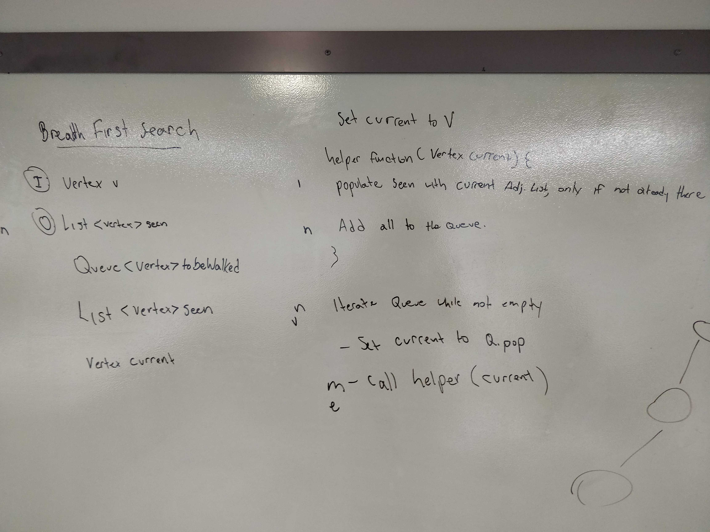
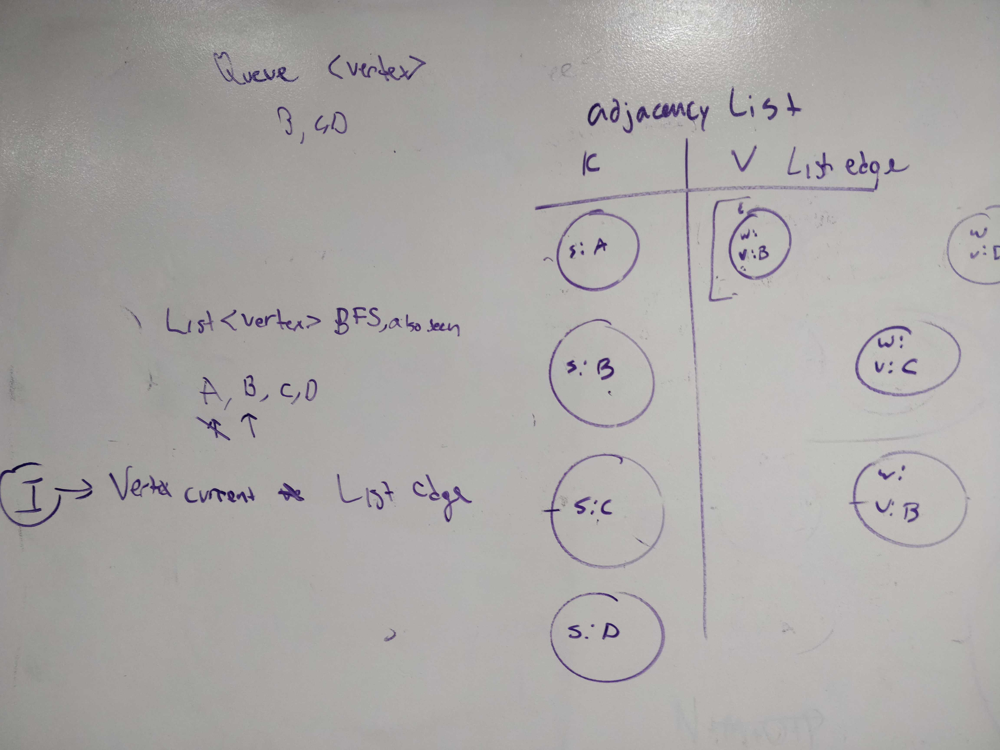

# Breadth First Search on a Graph
- Author: Jack Daniel Kinne.
- Challenge by: CodeFellows.
<!-- Short summary or background information -->
- implement a Breadth First Search on a Graph

## Challenge
<!-- Description of the challenge -->
- Extend your graph object with a breadth-first traversal method that accepts a starting node. Without utilizing any of the built-in methods available to your language, return a collection of nodes in the order they were visited. Display the collection.
  
## Approach & Efficiency
- create a queue of vertexes to be walked
- create a list of seen vertexes
- create a current vertex
- write a helper function to populate seen with current adj. list. add all from the list to the queue.
- iterate queue while not empty
- set current to queue.pop
- call helper function within iteration

## whiteboard

## Big O
- Time:
- N^M
- vertex^edge
- Space:
- N + N + 1 = N

## credits and contributions
- Demi the dog
- Ginger the dog
- https://www.baeldung.com/java-graphs
