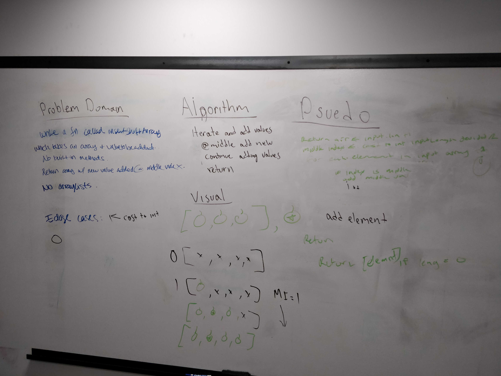

# Reverse an Array
Author: Jack Daniel Kinne.
Challenge by: Codefellows.
<!-- Short summary or background information -->
take an array as input.
reverse an array.
return an reversed.

## Challenge
<!-- Description of the challenge -->
see above.

## Approach & Efficiency
<!-- What approach did you take? Why? What is the Big O space/time for this approach? -->
the direct approach with iterating backwards, and pushing into a seperate list.  
this approach forced a Big O of n for complexity, as it must walk the entire list.  after speaking with two members of my cohort (listed below) I decided to move to a swap solution that had Big O of log n.  

## Solution
<!-- Embedded whiteboard image -->
see jpg attached.

## credits and contributions
Jackie 
Brandon
