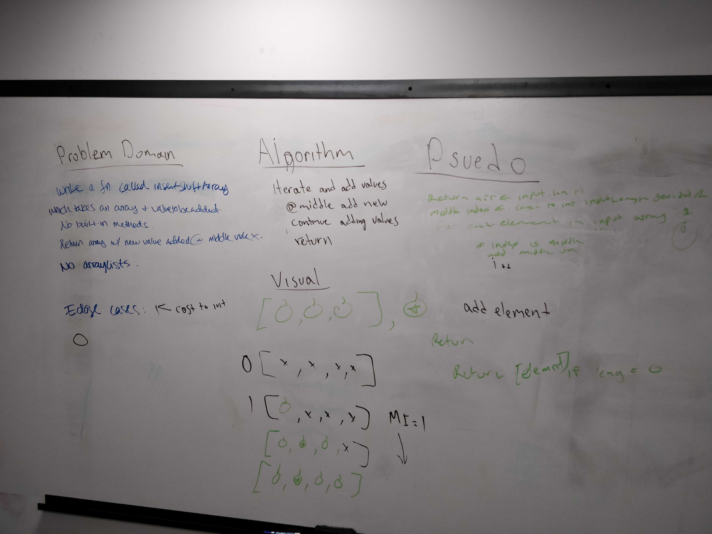

# Reverse an Array
Author: Jack Daniel Kinne.
Challenge by: Codefellows.
<!-- Short summary or background information -->
write a method that takes an array and value to be added .
return an array with the new value added at the middle index.

## Challenge
<!-- Description of the challenge -->
no built in functional calls.
no arraylists.  just arrays.

## Approach & Efficiency
<!-- What approach did you take? Why? What is the Big O space/time for this approach? -->
find the middle index of array, cast to int.
create new array with length plus one.
iterate and assign values in.
return.

## Solution
<!-- Embedded whiteboard image -->

## credits and contributions
Matt Stuhring
