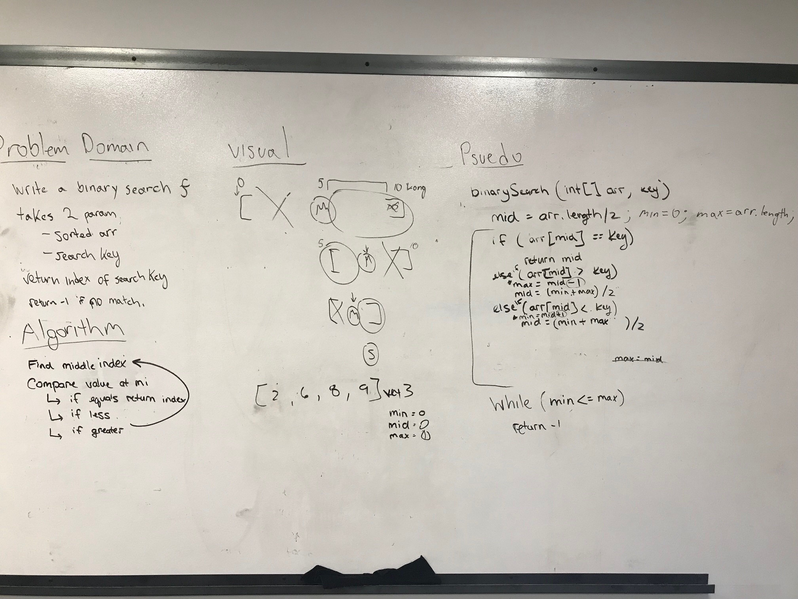

# Reverse an Array
Author: Jack Daniel Kinne.
Challenge by: Codefellows.
<!-- Short summary or background information -->
write a binary search function

## Challenge
<!-- Description of the challenge -->
takes two params: 
 - array
 - search key
 returns index of key or -1 if not found.
 performs in log n time.

## Approach & Efficiency
<!-- What approach did you take? Why? What is the Big O space/time for this approach? -->
find the middle index of array, 
if value, return index.
if less, set new max.  
if more, set new min. 
find new middle at half, repeat.
if out of bounds, return -1.

## Solution
<!-- Embedded whiteboard image -->

## credits and contributions
Peter Lee
