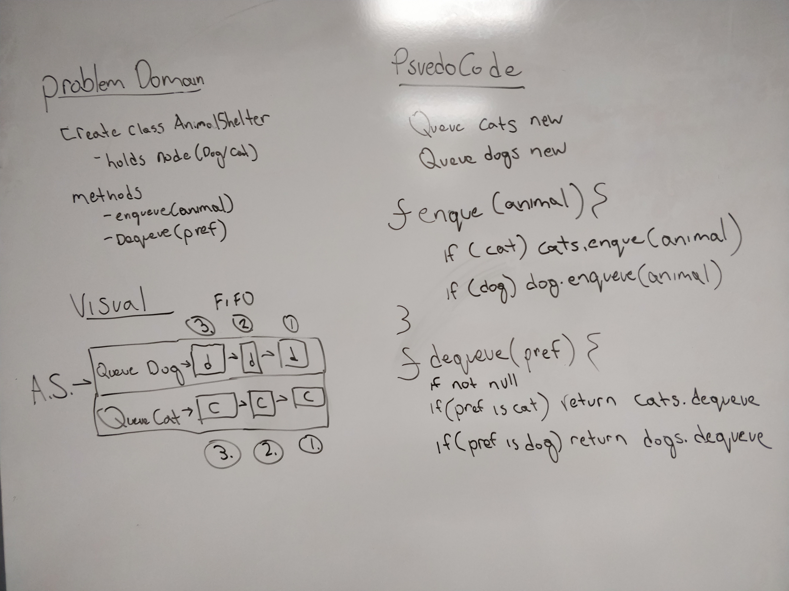

# Reverse an Array
Author: Jack Daniel Kinne.
Challenge by: Codefellows.
<!-- Short summary or background information -->
- create a class that holds dogs or cats.
- FIFO
- enqueue
- dequeue

## Challenge
<!-- Description of the challenge -->
Create a class called AnimalShelter which holds only dogs and cats. The shelter operates using a first-in, first-out approach.
Implement the following methods:
enqueue(animal): adds animal to the shelter. animal can be either a dog or a cat object.
dequeue(pref): returns either a dog or a cat. If pref is not "dog" or "cat" then return null.

## Approach & Efficiency
<!-- What approach did you take? Why? What is the Big O space/time for this approach? -->
- use two queues for cats and dogs.
- node contains data for if its a cat or a dog.
- win.

## Solution
<!-- Embedded whiteboard image -->

## credits and contributions
- Evan Slaton
- Matt Stuhring
