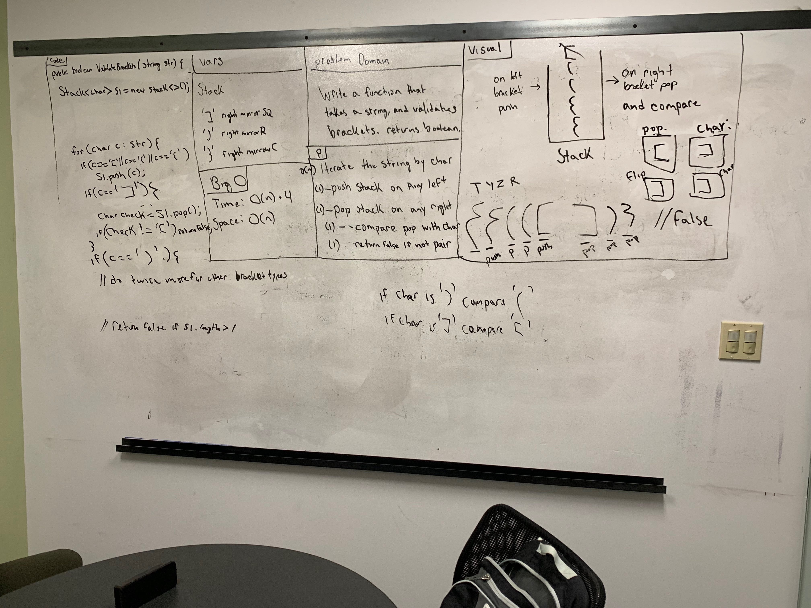

# Multi bracket validation
Author: Jack Daniel Kinne.
Challenge by: Codefellows.
<!-- Short summary or background information -->
- write a function to validate brackets to balance them.

## Challenge
<!-- Description of the challenge -->
Java: a method public static boolean multiBracketValidation(String input)
Your function should take a string as its only argument, 
and should return a boolean representing whether or not the brackets 
in the string are balanced. There are 3 types of brackets:

- Round Brackets : ()
- Square Brackets : []
- Curly Brackets : {}

## Approach & Efficiency
<!-- What approach did you take? Why? What is the Big O space/time for this approach? -->
- push left brackets into stack
- pop when you encounter a right bracket, check pop for its mirror.  
- check the stack to make sure all matches occur.
- big (o)n

## Solution
<!-- Embedded whiteboard image -->

## credits and contributions
Melfi Perez
