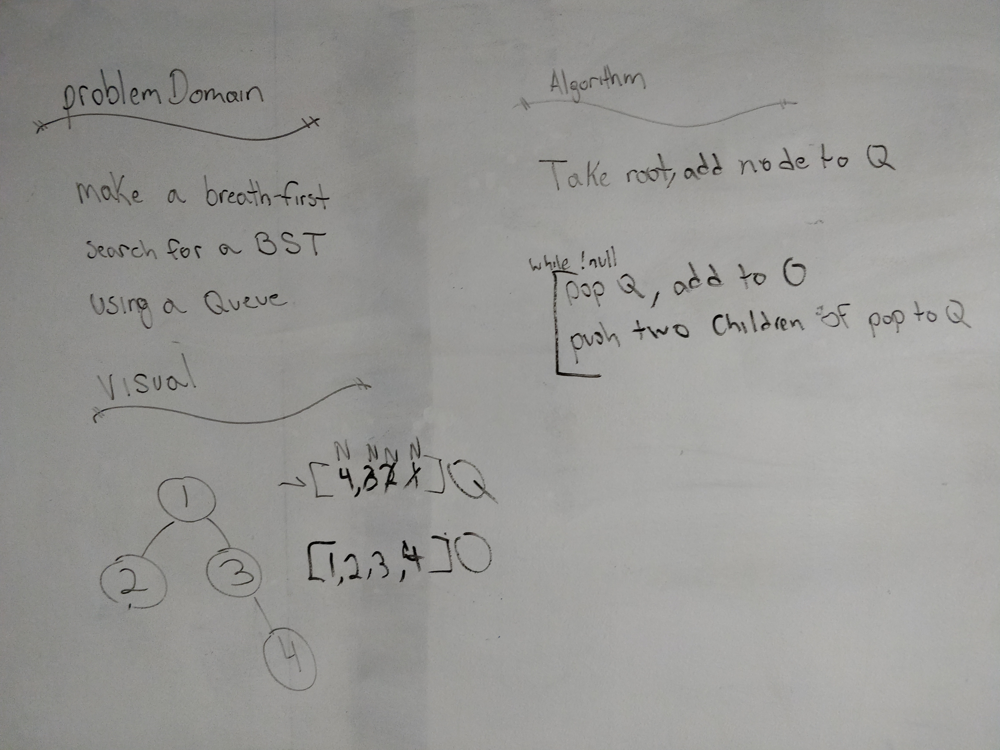

# Binary Tree Breadth first search
Author: Jack Daniel Kinne.
Challenge by: Codefellows.
<!-- Short summary or background information -->
- write a function to do a breadth first search on a binary tree.

## Challenge
<!-- Description of the challenge -->
Write a breadth first traversal method which takes a Binary Tree as 
its unique input. Without utilizing any of the built-in methods 
available to your language, traverse the input tree using a Breadth-first 
approach; print every visited node’s value.

## Approach & Efficiency
<!-- What approach did you take? Why? What is the Big O space/time for this approach? -->
- add root node to Queue
- while not null, pop Queue and add to output.
- push two children (if not null) to Queue.
- end while, return output.

## Solution
<!-- Embedded whiteboard image -->

## credits and contributions
Melfi Perez
