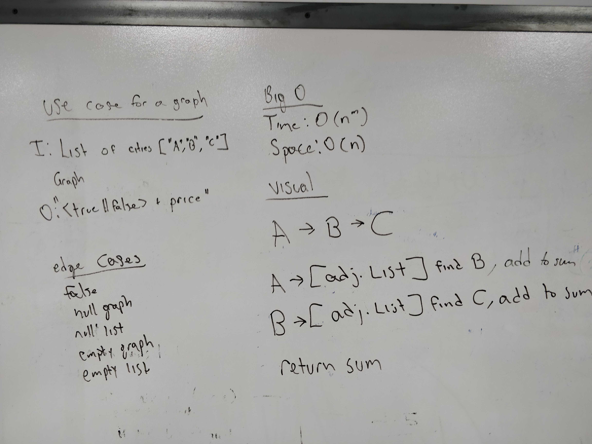

# Real Use Case for a Graph
- Author: Jack Daniel Kinne.
- Challenge by: CodeFellows.
<!-- Short summary or background information -->
- Given a business trip itinerary, and an Alaska Airlines route map, is the trip possible with direct flights? If so, how much will the total trip cost be?

## Challenge
<!-- Description of the challenge -->
-  Write a function based on the specifications above, which takes in a graph, and an array of city names. 
Without utilizing any of the built-in methods available to your language, return whether the full trip is possible with direct flights, and how much it would cost.

## Approach & Efficiency
- catch results of a BF search
- iterate results
- if each exists in the array, add weight to sum
- else return false, 0.
- return true, sum.

## whiteboard

## credits and contributions
- Demi the dog
- Ginger the dog
- https://www.baeldung.com/java-graphs
- Travis Cox
