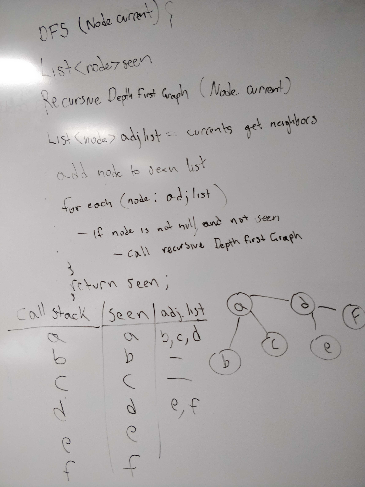

# Depth First Search - Graph
- Author: Jack Daniel Kinne.
- Challenge by: CodeFellows.
<!-- Short summary or background information -->
- Implement a DFS on your graph.   

## Challenge
<!-- Description of the challenge -->
-  Create a function that accepts an adjacency list as a graph, and conducts a depth first traversal. Without utilizing any of the built-in methods available to your language, 
return a collection of nodes in their pre-order depth-first traversal order

## Approach & Efficiency
- create recursive function
- Grab an adjacency list 

## whiteboard

## credits and contributions
- Ginger the dog
- https://java2blog.com/depth-first-search-in-java/
- Travis Cox
