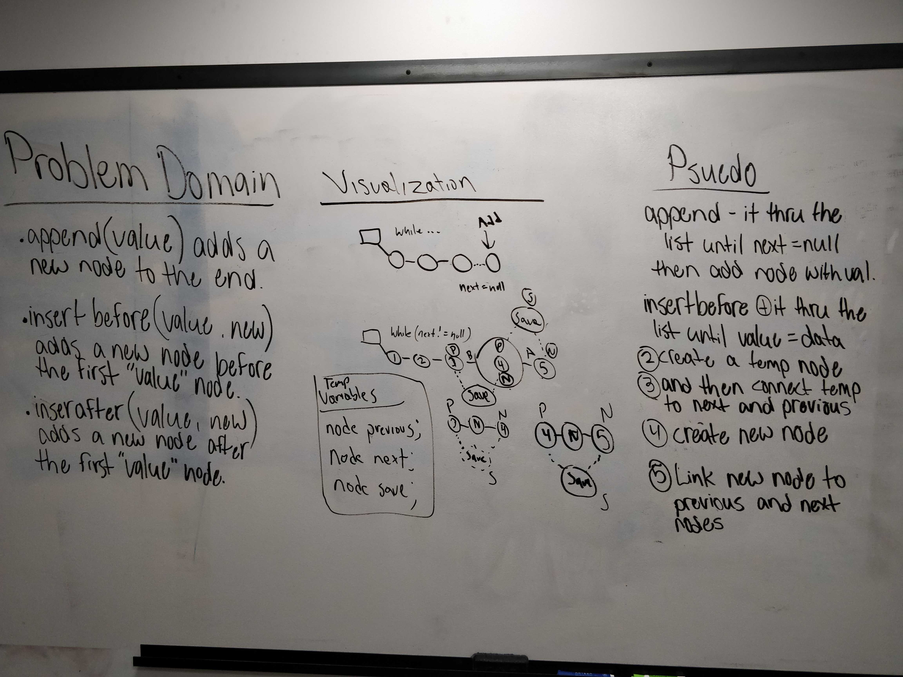

# Reverse an Array
Author: Jack Daniel Kinne.
Challenge by: Codefellows.
<!-- Short summary or background information -->
write a linked list from scratch without using a prebuilt constructor.
add to this challenge by making an insertbefore, insertafter, and 

## Challenge
<!-- Description of the challenge -->
Create a Node class that has properties for the value stored in the Node, and a pointer to the next Node.
Within your LinkedList class, include a head property. Upon instantiation, an empty Linked List should be 
created.
Define a method called insert which takes any value as an argument and adds a new node with that value to the 
head of the list with an O(1) Time performance.
Define a method called includes which takes any value as an argument and returns a boolean result depending 
on whether that value exists as a Node’s value somewhere within the list.
Define a method called toString (or __str__ in Python) which takes in no arguments and returns a string 
representing all the values in the Linked List.

## Approach & Efficiency
<!-- What approach did you take? Why? What is the Big O space/time for this approach? -->
#### Create a linked List class
- holds method for insert and print
#### Create a node class
- holds data
#### Big O : 
- insert: O (1)
- print: O (n)
- create: O (1)

## Solution
<!-- Embedded whiteboard image -->

## credits and contributions
- Pair with Joachen Busch for whiteboarding
- https://www.cs.cmu.edu/~adamchik/15-121/lectures/Linked%20Lists/linked%20lists.html
- https://gist.github.com/es20641/1208340/06d598126d53b048058bc243cbc4e4dd7db9a23a

