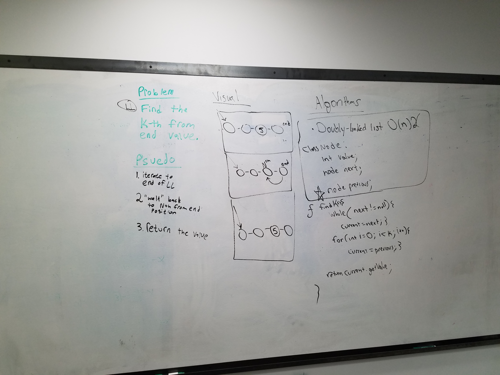

# Doubly linked List
Author: Jack Daniel Kinne.
Challenge by: Codefellows.
<!-- Short summary or background information -->
write a method to doubly link a list.

## Challenge
<!-- Description of the challenge -->
Write a method for the Linked List class which takes a number, k, as a parameter. 
Return the node’s value that is k from the end of the linked list. 
You have access to the Node class and all the properties on the Linked List 
class as well as the methods created in previous challenges.

## Approach & Efficiency
<!-- What approach did you take? Why? What is the Big O space/time for this approach? -->

- iterate through LL till end
- walk nth nodes back
- return data at nth node.

#### Big O : 
- insertRear: O (n)
- insertBefore: O (n)
- insertAfter: O (n)
- insert Kth from end: (n)

## Solution
<!-- Embedded whiteboard image -->

## credits and contributions
- Pair with Kevin Couture for whiteboarding
