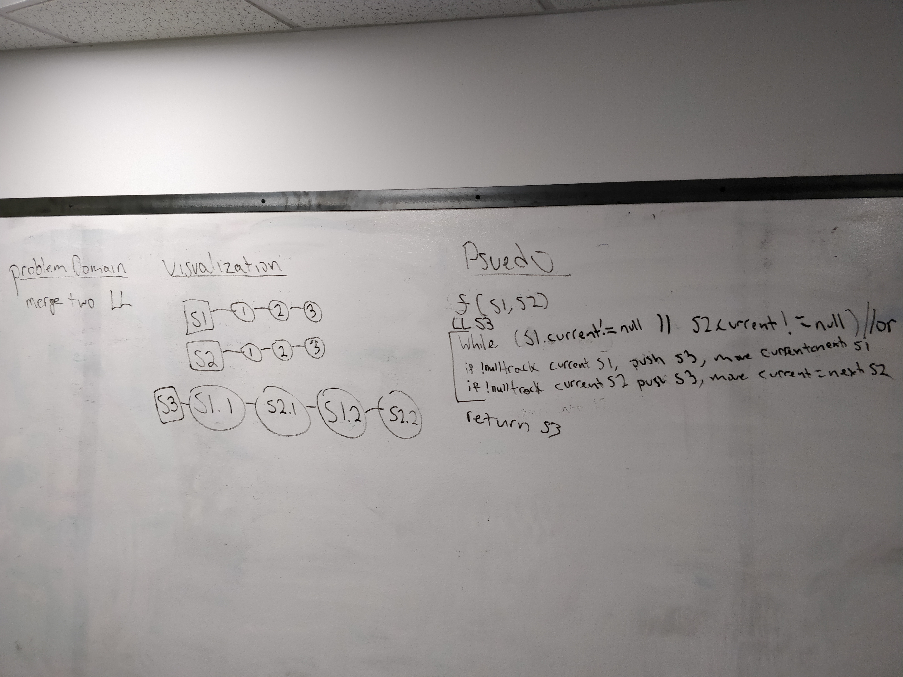

# Doubly linked List
Author: Jack Daniel Kinne.
Challenge by: Codefellows.
<!-- Short summary or background information -->
write a method to merge two lists.

## Challenge
<!-- Description of the challenge -->
Write a function called mergeLists which takes two linked lists as arguments. 
Zip the two linked lists together into one so that the nodes alternate between 
the two lists and return a reference to the head of the zipped list. 
Try and keep additional space down to O(1). You have access to the Node class 
and all the properties on the Linked List class as well as the methods created 
in previous challenges.

## Approach & Efficiency
<!-- What approach did you take? Why? What is the Big O space/time for this approach? -->

- create a new LL, S3
- iterate through both LL's, while s1 || s2 !null.
- push s1 current onto s3.  move s1.current to next.
- push s2 current onto s3.  move s2.current to next.

#### Big O : 
- insertRear: O (n)
- insertBefore: O (n)
- insertAfter: O (n)
- insert Kth from end: O(n)
- merge: O(n)

## Solution
<!-- Embedded whiteboard image -->

## credits and contributions
- Pair with Trevor Dobson for whiteboarding
